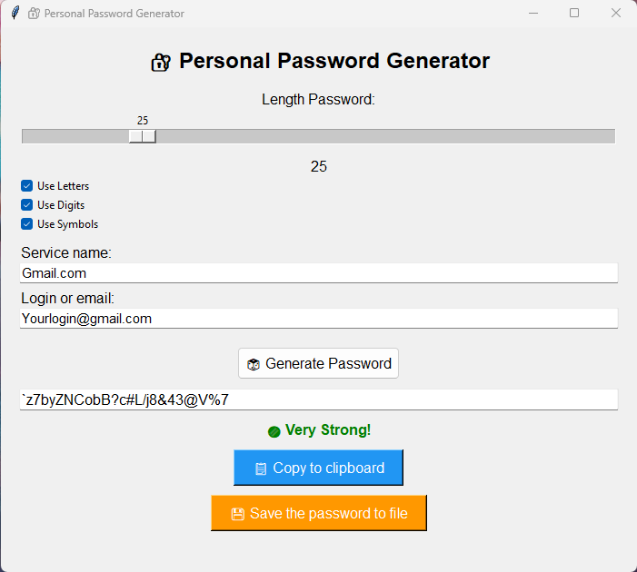
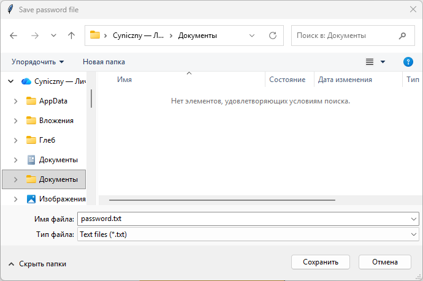
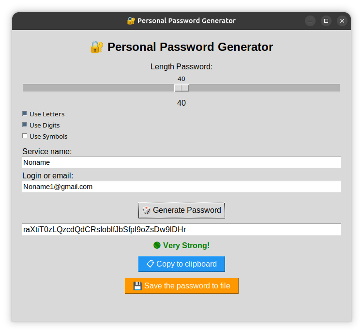
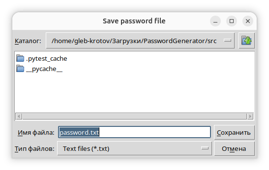

# 🔐 Personal Password Generator

**A secure and user-friendly password generator with a graphical interface, strength indicator, and file export feature.**

[](https://python.org)
[](LICENSE)
[](tests/)
[]()

---

## 📖 Table of Contents

- [About the Project](#about-the-project)
- [Features](#features)
- [How to Use](#how-to-use)
- [Quick Start](#quick-start)
- [Project Structure](#project-structure)
- [Running Tests](#running-tests)
- [Technologies](#technologies)
- [Roadmap](#roadmap)
- [License](#license)
- [Author](#author)

---

## About the Project

**"Personal Password Generator"** is a desktop application built with Python and a graphical interface for generating cryptographically secure passwords.

The application allows you to:
- Generate passwords with customizable length and character sets
- Evaluate their strength in real-time
- Save passwords with service names and login/email details

This project was created to practice:
- **GUI** development with `tkinter`
- **Cryptographic security** using the `secrets` module
- **Unit testing** with `unittest` and `pytest`
- Project structuring and **Git** version control

---

## ✨ Features

- 🖥️ **Graphical Interface** — intuitive window built with `tkinter`
- 🔐 **Secure Generation** — uses the `secrets` module (cryptographically secure)
- 📏 **Adjustable Length** — from 16 to 64 characters
- 🔤 **Character Selection** — letters, digits, special symbols
- 📊 **Strength Indicator** — `Not Safe` / `Moderate` / `Very Strong`
- 📋 **Copy to Clipboard** — one-click copy with visual confirmation
- 💾 **Save to File** — password + service name + login/email
- 📁 **Custom Save Location** — user chooses folder and file name
- ✅ **Tests** — 25 unit tests with `pytest`
- 🖥️ **Cross-platform** — works on Windows, Linux, and macOS

---

## How to Use

### Generating a Password

1. **Set the length** using the slider (16–64 characters)
2. **Select character types**:
   - ☑️ Letters
   - ☑️ Digits
   - ☑️ Symbols
3. Click **"Generate Password"**
4. The password appears in the field with a **strength indicator** below it

### Copying a Password

- Click **"📋 Copy to clipboard"** — the password is copied with a confirmation message

### Saving a Password

1. **Enter the service name** (e.g., `Google`)
2. **Enter your login or email** (e.g., `user@gmail.com`)
3. Click **"💾 Save the password to file"**
4. **Choose the location and file name** (default: `passwords.txt`)
5. The entry is saved in the format: Service: Google | Login/email: user@gmail.com | Password: P@ssw0rd!

### Example Interface

Your interface will look like this:

Windows:





Linux:





---

## Quick Start

### Requirements

- **Python 3.8** or higher
- `pip` (Python package manager)

### Installation

```bash
# Clone the repository
git clone https://github.com/cynicznykot/PasswordGenerator.git

# Navigate to the project folder
cd PasswordGenerator

# Create a virtual environment (recommended)
python -m venv .venv

# Activate the virtual environment
# Windows:
.venv\Scripts\activate
# macOS/Linux:
source .venv/bin/activate

# Install dependencies
pip install -r requirements.txt
```
### Running the application

```bash
# Via Python module
python -m src.main

# Or directly via file
python src/main.py
```
### Possible Issues on Linux

```bash
# Ubuntu/Debian
sudo apt install python3-tk

# Fedora
sudo dnf install python3-tkinter
```

## Project Structure
```bash
PasswordGenerator/
├── src/                   # Source code
│   ├── __init__.py        # Package initialization
│   ├── generator.py       # Generation and validation logic
│   ├── gui.py             # Graphical interface (tkinter)
│   └── main.py            # Entry point
├── tests/                 # Tests
│   ├── __init__.py
│   ├── test_generator.py  # 25 tests for logic
│   └── test_gui.py        # 8 tests for GUI (skipped)
├── images/                # Screenshots for README
├── .gitignore             # Git ignore rules
├── LICENSE                # MIT License
├── README.md              # Documentation (Russian)
├── README.en.md           # Documentation (English)
└── requirements.txt       # Dependencies
```

## Running Tests

### Installing Development Dependencies
```bash
pip install -r requirements-dev.txt
```

### Running Tests
```bash
# Run all tests
pytest tests/ -v

# Run with code coverage
pytest tests/ --cov=src --cov-report=html

# Run a specific test
pytest tests/test_generator.py -v
```

### Test Results 
```bash
============================= test session starts ==============================
collected 25 items

tests/test_generator.py::TestBuildCharacterPool::test_all_types PASSED
tests/test_generator.py::TestBuildCharacterPool::test_digits_only PASSED
tests/test_generator.py::TestBuildCharacterPool::test_letters_and_digits PASSED
tests/test_generator.py::TestBuildCharacterPool::test_letters_only PASSED
tests/test_generator.py::TestBuildCharacterPool::test_no_types PASSED
tests/test_generator.py::TestBuildCharacterPool::test_symbols_only PASSED
tests/test_generator.py::TestGeneratePassword::test_empty_pool PASSED
tests/test_generator.py::TestGeneratePassword::test_length_16 PASSED
tests/test_generator.py::TestGeneratePassword::test_length_30 PASSED
tests/test_generator.py::TestGeneratePassword::test_length_64 PASSED
tests/test_generator.py::TestGeneratePassword::test_pool_with_digits_only PASSED
tests/test_generator.py::TestGeneratePassword::test_pool_with_letters_only PASSED
tests/test_generator.py::TestGeneratePassword::test_randomness PASSED
tests/test_generator.py::TestGeneratePassword::test_zero_length PASSED
tests/test_generator.py::TestCheckStrength::test_empty PASSED
tests/test_generator.py::TestCheckStrength::test_moderate_letters_and_digits_16 PASSED
tests/test_generator.py::TestCheckStrength::test_moderate_letters_and_symbols_16 PASSED
tests/test_generator.py::TestCheckStrength::test_score_2 PASSED
tests/test_generator.py::TestCheckStrength::test_score_3 PASSED
tests/test_generator.py::TestCheckStrength::test_score_5 PASSED
tests/test_generator.py::TestCheckStrength::test_strong_all_types_16 PASSED
tests/test_generator.py::TestCheckStrength::test_strong_long_all_types_30 PASSED
tests/test_generator.py::TestCheckStrength::test_weak_only_digits_16 PASSED
tests/test_generator.py::TestCheckStrength::test_weak_only_lowercase_16 PASSED
tests/test_generator.py::TestCheckStrength::test_weak_short PASSED

============================= 25 passed in 0.03s ==============================

============================= test session starts ==============================
collecting ... collected 8 items

test_gui.py::TestGuiVariables::test_length_var_default SKIPPED (GUI
tests are slow, skipping for now)                                        [ 12%]
Skipped: GUI tests are slow, skipping for now

test_gui.py::TestGuiVariables::test_use_digits_default SKIPPED (GUI
tests are slow, skipping for now)                                        [ 25%]
Skipped: GUI tests are slow, skipping for now

test_gui.py::TestGuiVariables::test_use_letters_default SKIPPED (GUI
tests are slow, skipping for now)                                        [ 37%]
Skipped: GUI tests are slow, skipping for now

test_gui.py::TestGuiVariables::test_use_symbols_default SKIPPED (GUI
tests are slow, skipping for now)                                        [ 50%]
Skipped: GUI tests are slow, skipping for now

test_gui.py::TestGuiVariables::test_variables_created SKIPPED (GUI tests
are slow, skipping for now)                                              [ 62%]
Skipped: GUI tests are slow, skipping for now

test_gui.py::TestGuiFunctions::test_copy_password_called SKIPPED (GUI
tests are slow, skipping for now)                                        [ 75%]
Skipped: GUI tests are slow, skipping for now

test_gui.py::TestGuiFunctions::test_on_generate_called SKIPPED (GUI
tests are slow, skipping for now)                                        [ 87%]
Skipped: GUI tests are slow, skipping for now

test_gui.py::TestGuiFunctions::test_save_password_called SKIPPED (GUI
tests are slow, skipping for now)                                        [100%]
Skipped: GUI tests are slow, skipping for now

============================== 8 skipped in 0.02s ==============================
```

### Technologies

- **Python 3.8+** — programming language
- **Tkinter** — graphical interface
- **Secrets** — cryptographic security
- **Unittest / Pytest** — testing
- **Git** — version control

### Roadmap

- [x] ✅ **Automatic update checker** — the program checks for a new version at startup.
- [x] ✅ **Improved interface** — updated design with `ttk` and cleaner layout.
- [x] ✅ **Build for Windows and Linux** — ready-to-download executable files.
- [ ] 🔜 **Light / Dark theme toggle** — switch between light and dark interface modes.
- [ ] 🔜 **"Don't remind me about update" button** — dismiss update notifications for 24 hours.
- [ ] ⏳ **Saved passwords viewer** — a list of all entries with search, sorting, and filtering.
- [ ] ⏳ **Search by service name** — quick password lookup by service name.
- [ ] ⏳ **Import and export of passwords** — support for `.docx` (Word), `.csv` (Excel/Google Sheets), and `.json` (for data transfer).
- [ ] ⏳ **File encryption for stored passwords** — protect user data.
- [ ] ⏳ **Master password feature** — secure access to the program with a single master password.
- [ ] ⏳ **Build for macOS** — support for all major platforms.

### License 

Distributed under the **MIT**. See the [LICENSE](LICENSE) file for details.

## Author

**CynicznyKot**

- GitHub: [@cynicznykot](https://github.com/cynicznykot)
- Project: [PasswordGenerator](https://github.com/cynicznykot/PasswordGenerator)

---

## Support the Project

If you liked this project, please give it a ⭐ on GitHub! I would be very grateful! 😊

